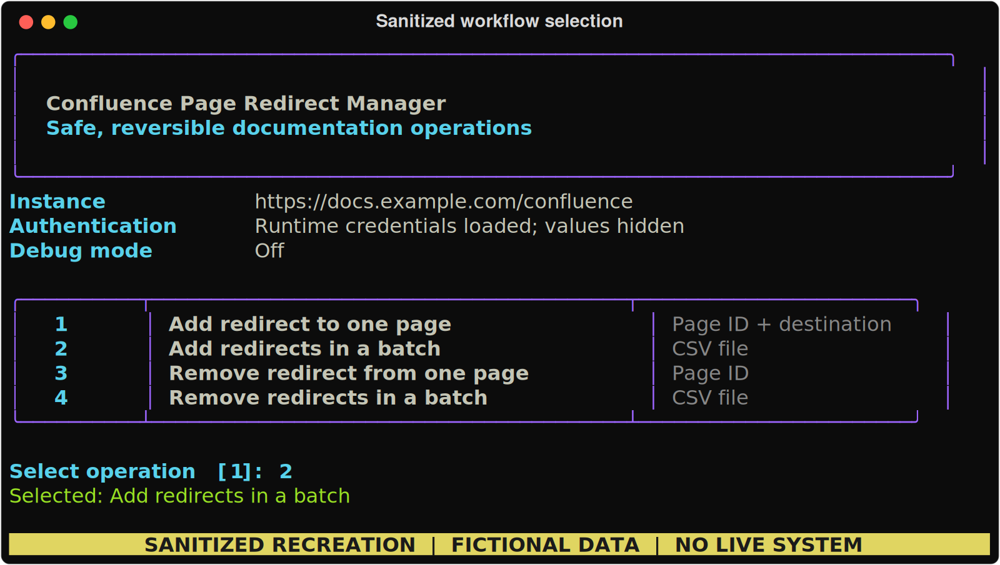
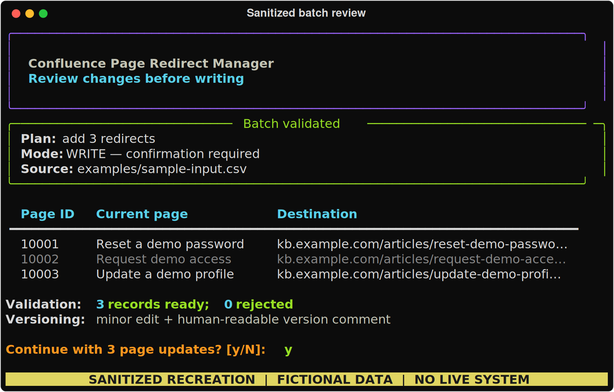
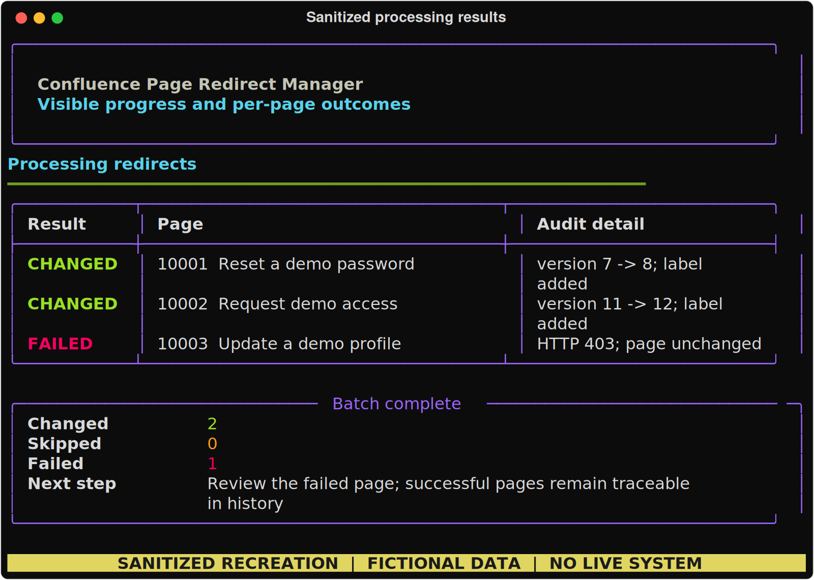

# Confluence Migration Automation — Sanitized Portfolio Case Study

> [!IMPORTANT]
> This repository is a **demonstration artifact**, not a supported production tool. The original
> utilities were developed by John Paz while working as a contract technical writer supporting
> Airbnb. This public repository is an AI-assisted, sanitized reconstruction created with OpenAI
> Codex under John's direction. It contains no employer source files or production data, and this
> exact reconstruction has not been integration-tested against a live Confluence instance.

## The case study in 30 seconds

| | |
| --- | --- |
| **Challenge** | A large documentation migration required thousands of repetitive Confluence changes that would have taken hundreds of hours through the UI. |
| **John's role** | Defined the operational requirements, operator workflows, safeguards, and documentation; directed AI-assisted implementation; reviewed and tested the original tools in the working environment; and maintained functioning versions in Git. |
| **Outcome** | Six teammates relied on the original tool family. Collectively, the tools saved hundreds of hours and helped the team complete the migration ahead of schedule. |
| **Artifact here** | One representative workflow—redirect management—reconstructed with fictional data to demonstrate the API, CLI, safety, and documentation patterns. |

The original family grew from a permission-management script into focused utilities for redirects,
macro cleanup, find-and-replace operations, permissions, and migration reporting. This repository
is evidence of the problem-solving and documentation approach behind that work; it is not the
original internal code.

## Operator experience

These images recreate the original Rich-style command-line experience with fictional page IDs,
titles, and `example.com` URLs. No live or internal system is shown.



*A focused menu made single-page, CSV batch, and reversal workflows discoverable without requiring
operators to memorize commands.*



*Operators could review the destination, record count, and dry-run state before authorizing a
write.*



*Per-page feedback exposed partial failures while version comments and labels supported later
verification.*

## What the sample demonstrates

- Version-aware Confluence REST API reads and writes
- Single-page and CSV batch processing
- Preview and explicit confirmation before writes
- A dry-run path that performs no mutation
- Minor-edit flags and version comments for traceability
- A tracking label for finding changed pages
- Per-page results so one failure does not hide the rest of a batch
- Reversible changes that preserve the original page body
- Runtime-only credentials and diagnostics that omit credentials and page bodies
- Typed boundaries between the CLI, service layer, and API client

The target system is intentionally generic. Operators provide complete destination URLs; no former
employer routing rules, hostnames, identifiers, or business logic remain.

## Evidence, attribution, and boundaries

- [Contribution statement](CONTRIBUTIONS.md) — what John owned in the original work and what Codex
  produced for the public reconstruction
- [Portfolio note](PORTFOLIO-NOTE.md) — provenance, sanitization, validation status, and claim
  boundaries
- [Colleague perspectives](https://github.com/johnapaz/confluence-automation-toolkit-sample/issues/2)
  — an open thread for voluntary firsthand comments about the original tool family
- [Colleague outreach guide](docs/requesting-colleague-perspectives.md) — consent, confidentiality,
  and a message that asks for firsthand comments without scripting an endorsement
- [Paste-ready portfolio entry](docs/portfolio-entry.md) — short and expanded summaries for a
  portfolio document

Airbnb did not sponsor, review, or endorse this repository. Any colleague comments are personal
statements by their authors, not employer endorsements.

## Safety model

Every write follows the same sequence:

1. Validate the input record and destination URL.
2. Fetch the latest page body and version.
3. Build a proposed next version without discarding the existing body.
4. Stop after reporting the plan when `--dry-run` is active.
5. Require confirmation unless the operator deliberately passes `--yes`.
6. Write a minor edit with a human-readable version comment.
7. Add or remove a tracking label and report label failures separately.

Removal targets only redirect markup carrying this sample's management marker. It does not delete
unrelated HTML macros.

## Technical documentation

- [Usage guide](docs/usage.md) — configuration, commands, CSV contracts, and troubleshooting
- [Architecture](docs/architecture.md) — components, data flow, and design decisions
- [API reference](docs/api-reference.md) — REST calls, Python interfaces, and result states
- [Publication checklist](docs/publication-checklist.md) — owner review before sharing or reuse

## Optional local evaluation

The commands below exercise the reconstructed sample. They do not make it production-ready.
Confluence Cloud and Server/Data Center deployments differ in authentication, storage-format
behavior, HTML macro policy, and minor-edit support. Use only an authorized non-production space.

```bash
python -m venv .venv
source .venv/bin/activate
pip install -e .

export CONFLUENCE_BASE_URL="https://docs.example.com/confluence"
export CONFLUENCE_USERNAME="portfolio-user"
export CONFLUENCE_API_TOKEN="<set-locally>"

confluence-toolkit --dry-run add --csv examples/sample-input.csv
```

The public reconstruction has offline unit tests for transformation, validation, and request-body
behavior. It has **not** been run against a live Confluence API.

```bash
pip install -e '.[dev]'
pytest
ruff check .
```

## Repository structure

```text
.
├── assets/                    # Sanitized CLI screenshots
├── docs/                      # Portfolio, usage, architecture, and API documentation
├── examples/                  # Fictional CSV input and representative console output
├── scripts/                   # Reproducible screenshot renderer
├── src/confluence_toolkit/    # CLI, REST client, models, and redirect service
├── tests/                     # Offline unit tests; no Confluence access required
├── CONTRIBUTIONS.md           # Authorship and contribution boundaries
├── PORTFOLIO-NOTE.md          # Provenance and disclosure
└── pyproject.toml             # Package metadata and development tooling
```

## Use and licensing

This repository was made to demonstrate prior documentation-operations work. It is not maintained
as a migration resource, and no operational support is offered. No license is included; public
visibility does not grant permission to reuse the code beyond rights provided by GitHub's terms.
