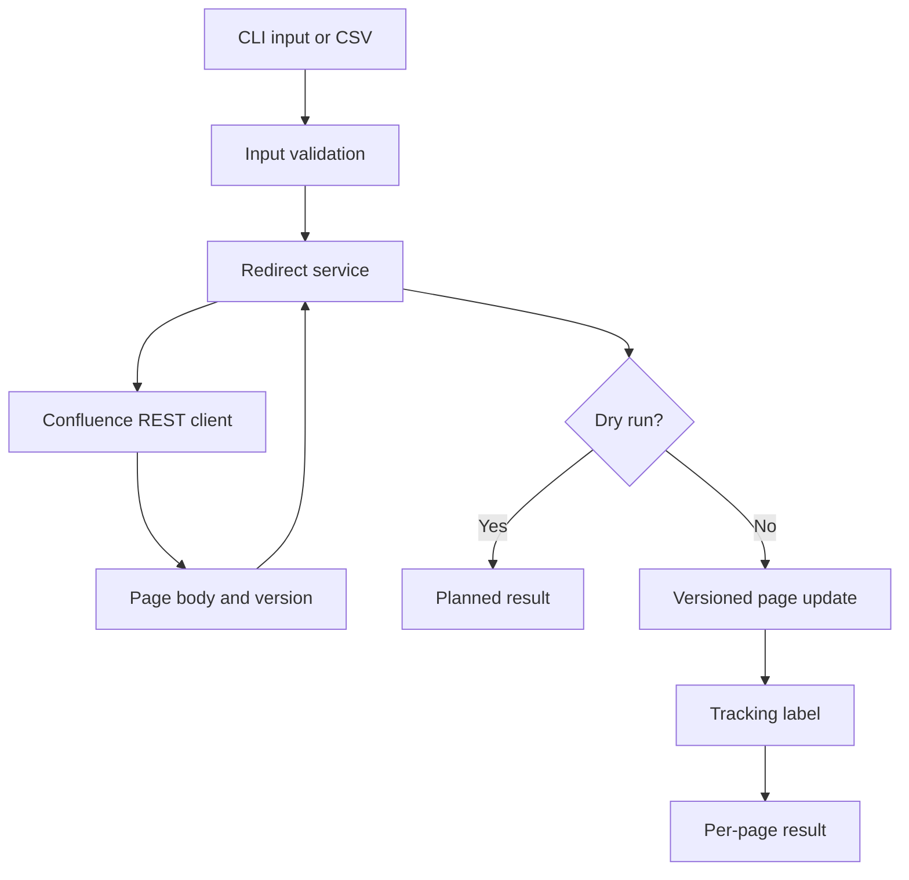

# Architecture

## Purpose

The sample automates a narrow but consequential documentation-operations task: placing reversible
redirect notices on migrated Confluence pages. It separates API transport, content transformation,
and operator interaction so each concern can be reviewed and tested independently.

## Components

| Component | Responsibility | Deliberate boundary |
| --- | --- | --- |
| `cli.py` | Parse commands, load runtime configuration, preview work, confirm writes, and summarize results | Does not assemble REST payloads or manipulate storage markup |
| `redirects.py` | Validate CSV rows and URLs; add or remove managed redirect markup; coordinate labels and results | Does not know how authentication or HTTP sessions are configured |
| `client.py` | Authenticate, call the required REST endpoints, validate response status, and map page responses | Does not prompt users or decide whether an operation should run |
| `models.py` | Define the page snapshot, redirect request, and operation result contracts | Contains no I/O |
| `errors.py` | Provide errors that the CLI can report cleanly | Separates expected failures from tracebacks |

## Operation lifecycle

### Add redirect

1. Read one request from flags or one or more requests from CSV.
2. Validate required fields and allow only `http` or `https` targets.
3. Fetch `body.storage` and `version` for the source page.
4. Refuse to add a second redirect managed by this sample.
5. Escape operator-controlled text and prepend the redirect macro.
6. In dry-run mode, return the proposed next version without writing.
7. Otherwise, increment the page version, mark the update as minor, and add a version comment.
8. Apply the `redirected` label. If labeling fails after the content update, report that partial
   success as a warning rather than claiming the whole operation failed.

### Remove redirect

1. Fetch the latest page body and version.
2. Locate the HTML macro containing the sample's management marker.
3. Leave the page unchanged when no managed redirect is present.
4. Remove only the marked macro and preserve all other content.
5. Write a new minor version with a removal comment.
6. Remove the tracking label; a missing label is treated as already clean.

## Safety and auditability

The API requires the next page version number, which provides basic optimistic concurrency. The
service fetches immediately before composing an update and never reuses a version supplied by the
CSV. Confluence version history remains the authoritative rollback path.

Additional controls are layered around that API behavior:

- dry-run results use the `planned` state and call no mutation method;
- interactive writes default to **no** at the final confirmation;
- destination text and URLs are HTML-escaped before insertion;
- a management marker narrows the removal pattern;
- every result records action, state, page identity, message, and known versions;
- batch failures are normalized per page so later records can continue.

The tool does not log response bodies, page content, usernames, or tokens. HTTP errors include a
request identifier when the server returns one, which helps an operator investigate without
printing sensitive payloads.

## Sanitization decisions

The original tools used environment-specific domains, authentication terminology, destination-ID
routing rules, internal team names, and a migration macro taxonomy. This reconstruction replaces
those details with runtime configuration, complete operator-supplied target URLs, neutral sample
data, and a narrowly scoped public package.

The public code is a reconstruction of demonstrated patterns—not a line-for-line publication of
internal source.
